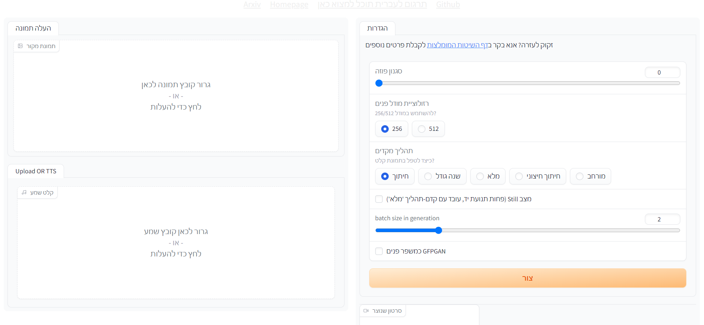

# SadTalker-hebrew
The SadTalker project is translated into Hebrew

תוכל להוריד את הפרויקט המקורי [כאן](https://github.com/OpenTalker/SadTalker)
ואז להוריד את השיחרור ולהעתיק לתקיית הפרויקט שלך

## הוראות התקנה
  ## התקנה ידנית
1. את הקובץ  `app_sadtalker.py` עליך לשים בנתיב `SadTalker\app_sadtalker.py`
- עליך להחליף את כל הקבצים המקוריים בקבצים שתוריד מפה
  
